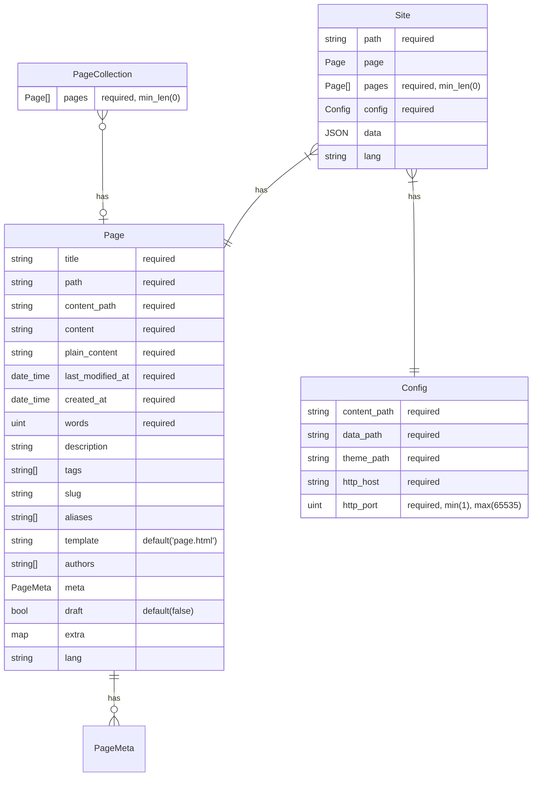

# Entities

```mermaid
erDiagram
  Page {
    string title "required"
    string path "required"
    string content_path "required"
    string content "required"
    string plain_content "required"
    date_time last_modified_at "required"
    date_time created_at "required"
    uint words "required"
    string description
    string[] tags
    string slug
    string[] aliases
    string template "default('page.html')"
    string[] authors
    PageMeta meta ""
    bool draft "default(false)"
    map extra
    string lang
  }
  Page ||--o{ PageMeta: has
  PageCollection }o--o| Page: has
  PageCollection {
    Page[] pages "required, min_len(0)"
  }
  Site |{--|| Page: has
  Site {
    string path "required"
    Page page
    Page[] pages "required, min_len(0)"
    Config config "required"
    JSON data
    string lang
  }
  Site |{--|| Config: has
  Config {
    string content_path "required"
    string data_path "required"
    string theme_path "required"
    string http_host "required"
    uint http_port "required, min(1), max(65535)"
  }
```
