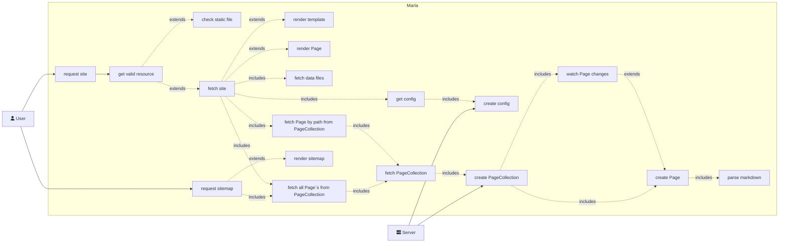

# Use Cases

```mermaid
flowchart LR
  subgraph Marla
    S[request site] -->R[get valid resource]
    R -. extends .->SF[check static file]
    R -. extends .->SITE[fetch site]
    SITE -. extends .->HTML[render template]
    SITE -. extends .->MD[render Page]
    SITE -. includes .->D[fetch data files]
    SITE -. includes .->P[fetch Page by path from PageCollection]
    SITE -. includes .->LC[get config]
    LC -. includes .->CF
    P -. includes .->FPC
    SITE -. includes .->PCP[fetch all Page`s from PageCollection]
    PCP -. includes .->FPC
    SM[request sitemap] -. includes .->PCP
    SM -. extends .->XML[render sitemap]
    PC[create PageCollection] -. includes .->PCW[watch Page changes]
    FPC[fetch PageCollection] -. includes .->PC
    PCW -. extends .->CP
    PC -. includes .->CP[create Page]
    CP -. includes .->PMD[parse markdown]
    CF[create config]
  end
U["fa:fa-user User"] -->S
U -->SM
SRV["fa:fa-server Server"] -->PC
SRV-->CF
```
